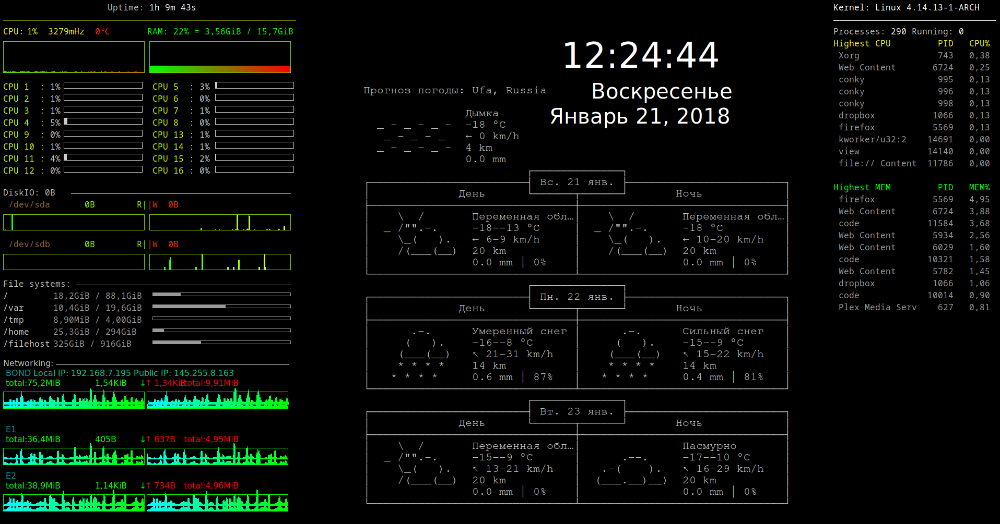
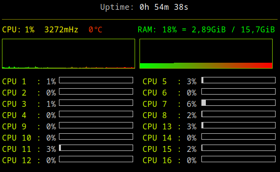
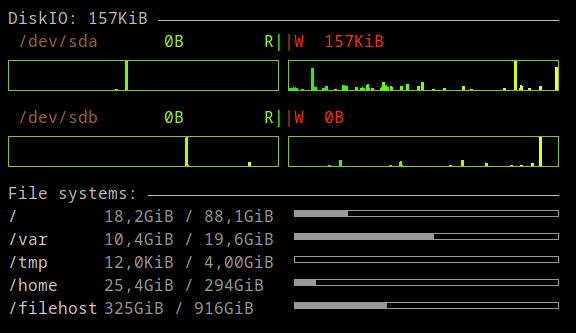
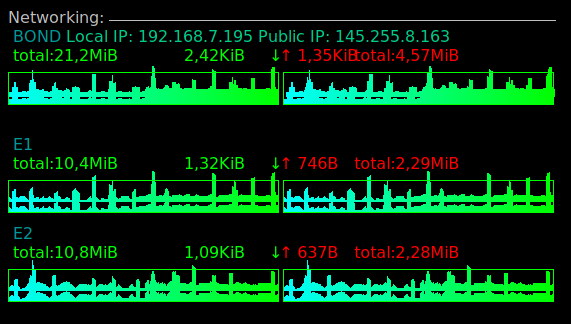
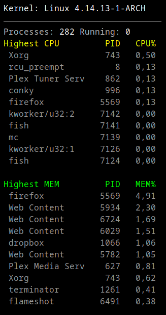

# PhilDiv



## About

This repository contains a rework of [philosophos's](https://github.com/brndnmtthws/conky/wiki/User-Configs#philosophos) Conky configuration. The main difference is that this version is more divided than the original one.

## Usage

To use this configuration you just have to include following lines in your `.xprofile`.

```xprofile
conky -c ~/.config/conky/conkyproc.conf &
conky -c ~/.config/conky/conkycpu.conf &
conky -c ~/.config/conky/conkydisk.conf &
conky -c ~/.config/conky/conkynet.conf &
conky -c ~/.config/conky/conkyweather.conf &
```

## Description

The configuration consists from 5 parts:

* `conkycpu.conf` --- displays CPU and RAM usage info.



* `conkydisk.conf` --- displays Disk usage info



* `conkynet.conf` --- displays Network usage info



* `conkyproc.conf` --- displays kernel version and top 10 CPU/RAM intensive programs



* `conkyweather.conf` --- displays weather and current date

Weather Forecast is being taken from [wttr.in](http://wttr.in/). The output of this web-service can be configured as shown in [the official help page](http://wttr.in/:help). For example `http:\\wttr.in?3nT` will give you the output like on the above picture but it will be represented in english.

## Requirements

Following fonts are used in this configuration:

* `NotoSansMono-Regular`
* `NimbusMonoPS-Regular`
* `Mallige`
* `Impact`
* `Conky Icons by Carelli`